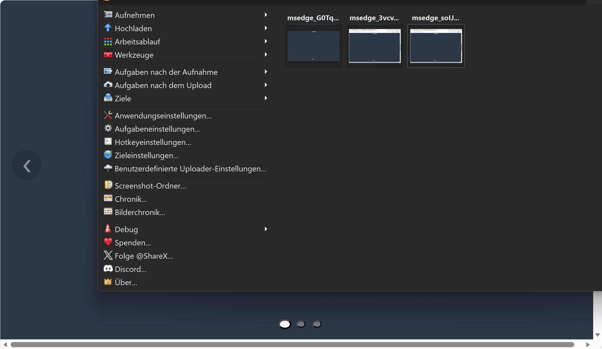

# ChatGPT-Me-Projects
GIFs with: ShareX
### Folder: srvDesktop
-- v1 -- A lightweight JavaScript desktop/workspace navigation library.
 Originally developed by Eduard together with ChatGPT during the development of a server monitoring dashboard.
 Negatives: Performance is =/
 

<!--  INFO

-->
### Folder: python_stuff
-- v1 -- audio_to_text_for_pi.py: Small version for an Raspberry Pi 3 with 1GB RAM to convert an audio mp3 file to an wav + get the text out of it
#### ToDos
   apt install python3-pip python3-full python3-venv ffmpeg
   python3 -m venv whisper-env
   source whisper-env/bin/activate
   pip install faster-whisper
   python3 -m venv whisper-env
   source whisper-env/bin/activate
